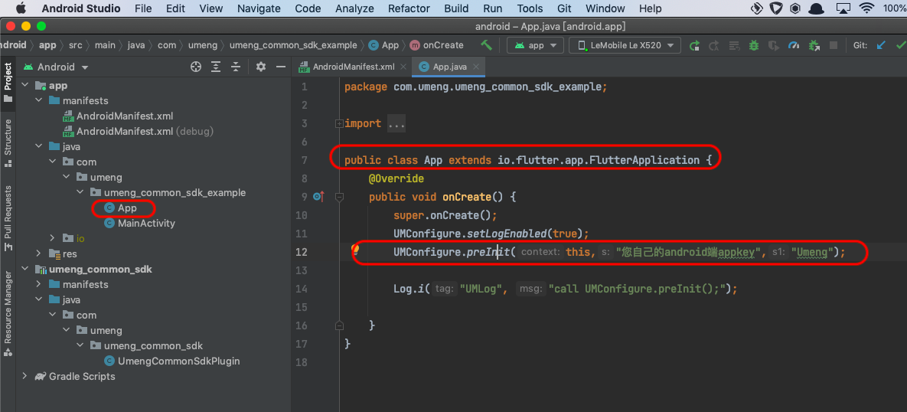
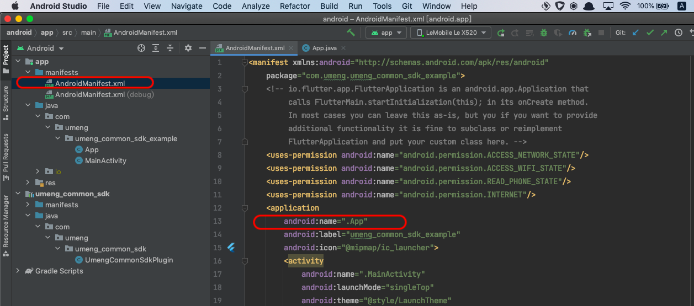

# umeng_common_sdk Flutter Plugin

# 安装

在工程 pubspec.yaml 中加入 dependencies

dependencies:
  umeng\_common\_sdk: 1.2.4

# 使用

import 'package:umeng\_common\_sdk/umeng\_common\_sdk.dart';

# 插件SDK初始化

## Android端

请参考本工程中示例Android 宿主工程中App.java文件(example/android/app/src/main/java/com/umeng/umeng_common_sdk_example/App.java)，给您的flutter工程Android宿主工程增加App类，注意此类必须是 io.flutter.app.FlutterApplication 类的子类。在App类的onCreate生命周期函数内，调用原生统计SDK的预初始化方法UMConfigure.preInit，并传入appkey和渠道参数。

另外，您还需要在Android宿主工程AndroidManifest.xml清单文件中 application 配置中添加 “android:name”属性，其值为新增的 App 类。如下图：

注意，预初始化传入的appkey和渠道参数必须和后续在flutter工程的dart代码中调用的SDK正式初始化函数UmengCommonSdk.initCommon 传入的第一个参数(Android appkey)和第三个参数(Android 渠道)必须严格一致。

为了满足《隐私政策》要求，开发者必须保证在应用安装后，首次冷启动场景，只能在App用户同意隐私授权之后，才能调用flutter插件的UmengCommonSdk.initCommon接口真正初始化SDK。

用户已经同意隐私授权之后的后续应用冷启动，可以在flutter首个页面初始化时直接调用UmengCommonSdk.initCommon接口初始化SDK。

--- 

## iOS端

